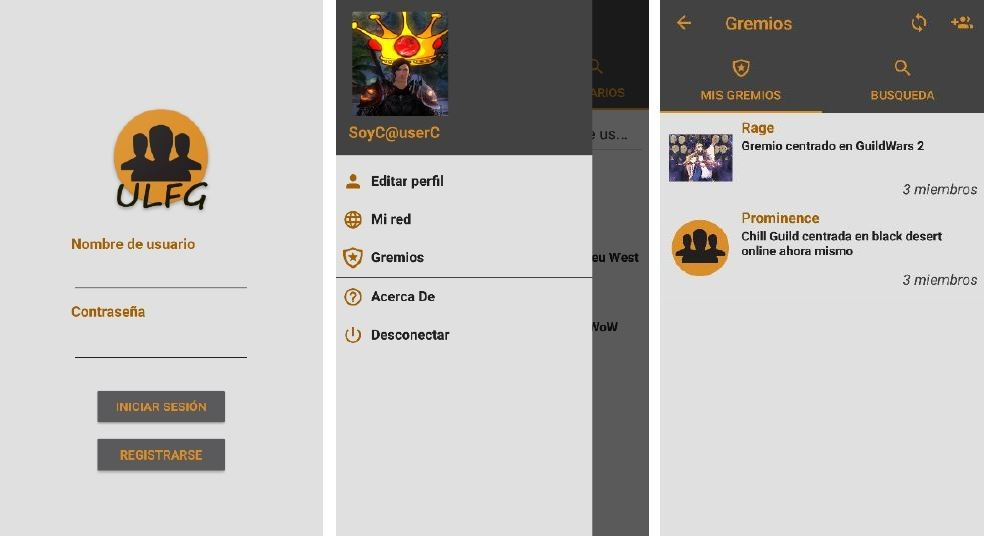

# ULFG (Universal Looking For Group)

ULFG se presento en Julio del 2018 en la facultad de Ingeniería Informática de Oviedo (Asturias, España) como Trabajo de Fin de Grado de Ingeniería Informática del Software.

<h2>Resumen del proyecto</h2>
ULFG consiste en una red social multiplataforma para Android y Windows similar a otras ya existentes, como Twitter, pero más orientada a los videojuegos y a sus comunidades. Esta aplicación permitirá a un usuario publicar mensajes visibles para otros usuarios, así como ver los de los demás usuarios.

Los usuarios también podrán crear y gestionar grupos personalizados (gremios) a los que se podrán unir otros usuarios. Se podrán publicar mensajes que solo serán visibles para un grupo concreto.

Cada usuario tendrá un perfil propio y personalizable que se mostrará públicamente a todos los demás.

<h2>Capturas de algunas pantallas de la aplicación</h2>

Para más información se puede consultar el documento pdf <strong>"Documentacion ULFG"</strong> dentro de la carpeta Documentación.
